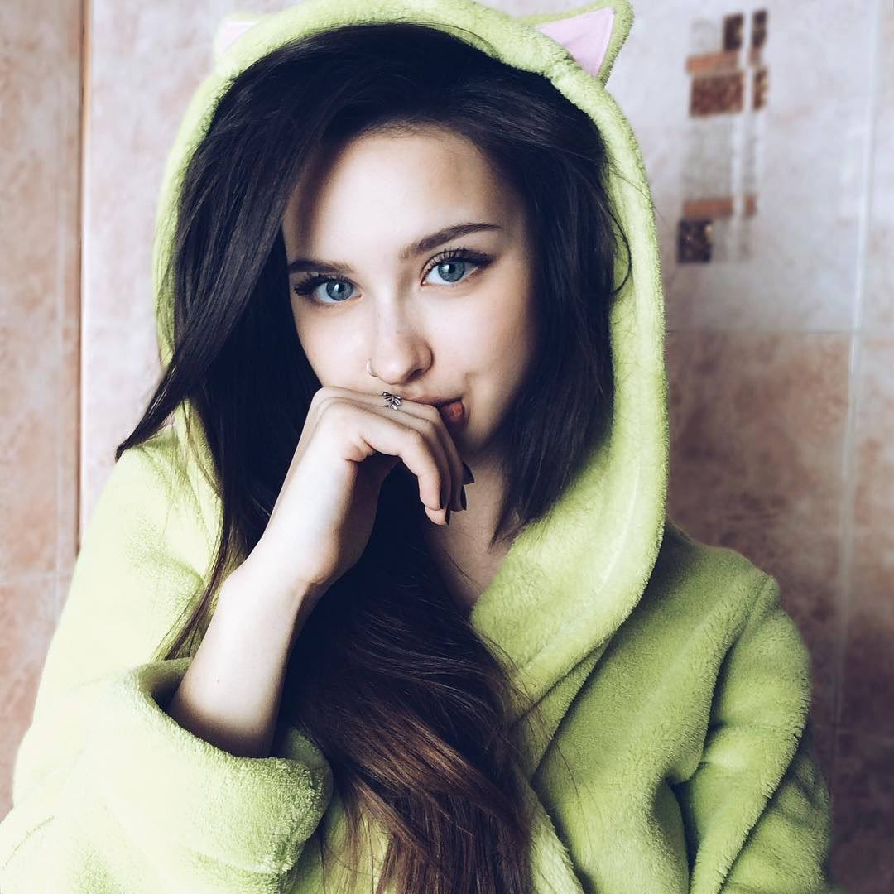

# Познакомимся!

*Меня зовут Алёна. Мне 23 года, я из Рязани.*

Я психиатр. Два года назад я окончила Санкт-Петербургский государственный университет по направлению «психология». Там же проходила курсы по коррекционной психиатрии детей.

**Уже в вузе начала работать** в коррекционной школе: сначала помощником психолога, потом тьютором. Для этой же школы разработала проект наставничества, в рамках которого подростки с расстройством аутического спектра учились самостоятельно решать учебные задачи. В проекте участвовало 30 подопечных.

**Мои сильные стороны** – я умею находить общий язык с разными людьми, терпеливый и самодостаточный человек. Я хороший слушатель и быстро учусь.

В качестве своих слабостей назову привязанность к подопечным и неумение отключаться от работы. Кажется, это положительные качества, но как психолог я знаю, что они могут привести к выгоранию. Я работаю над этими особенностями.

**Моя краткосрочная цель** – получить опыт самостоятельной работы с детьми с психическими особенностями. Я бы хотела быть полезной для вас.